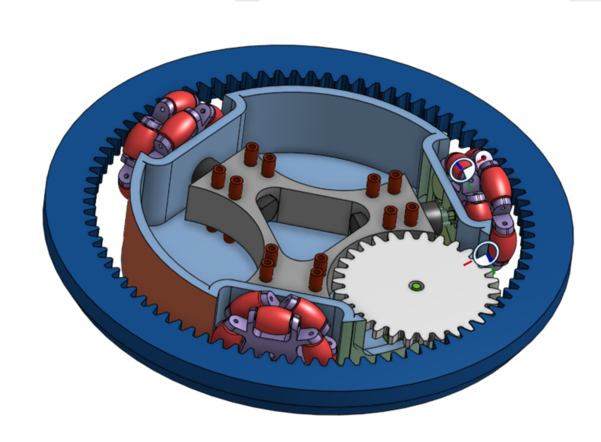
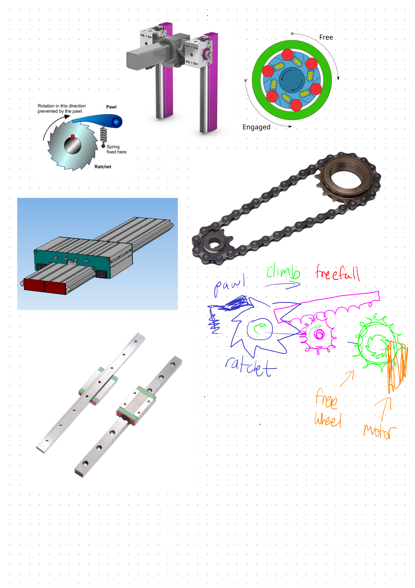

# battlebot
1-3 lb Personal Battlebot for IEEE@UH Robotics

## Overview
This repository contains the design files, documentation, and development history of my personal combat robot projects. Future updates will include more detailed schematics, wiring diagrams, and comprehensive build documentation.

## Robot Designs

| Robot | Season | Components List | Status |
|-------|--------|----------------|--------|
| Shell Spinner | 2024-2025 | [📋 Components](shellspinner/COMPONENTS.md) | Complete |
| Kraken Hammer | 2026 | TBD | In Development |

## Project Timeline

### 2024-2025: Shell Spinner
The first iteration of this project was a shell spinner design, developed throughout the 2024-2025 season. Features a brushless motor-driven spinning shell with simplified planetary gear system (single planet and ring gear). See [shellspinner/](shellspinner/) for CAD files and detailed design.

### 2026: New Design
Starting in 2026, this project is evolving with a completely new robot design to explore different combat strategies and mechanisms. Check out [Design Decisions](docs/DESIGN_DECISIONS.md)

*Initial brainstorming for the 2026 robot design*
